<!--
  ⚡ Este README é GERADO AUTOMATICAMENTE por scripts/build.mjs (GitHub Actions, todo dia às 03:00 de Salvador).
  Para mudar textos, projetos em destaque, links ou a stack, edite o config.json — não este arquivo.
-->


  


  



  


<a href="https://github.com/csbarcellos-tk/safety-consulting-landing-page"></a>
<a href="https://github.com/csbarcellos-tk/Supermercado_project_V2.2"></a>
<a href="https://github.com/csbarcellos-tk/Farmacia"></a>
<a href="https://github.com/csbarcellos-tk/github-profile-template"></a>

  



  



  


  


 

