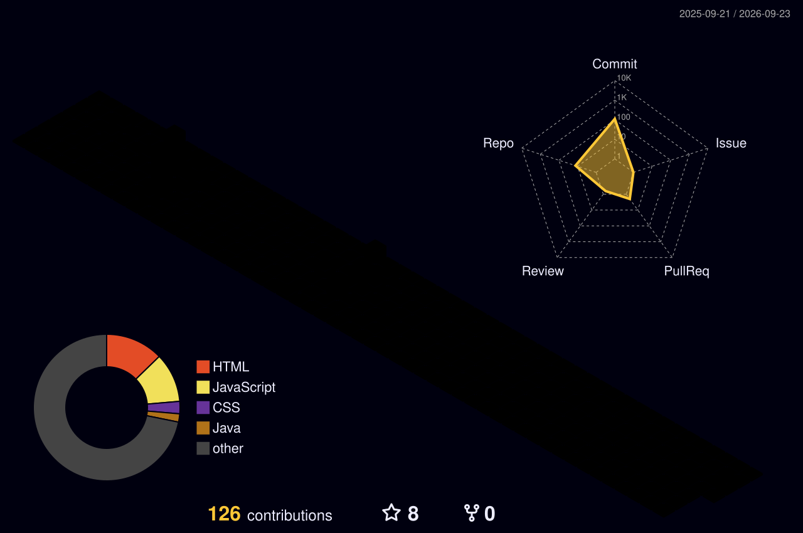

<!-- ═══════════════ HEADER ═══════════════ -->

  

  

  
  
  
  

<!-- ═══════════════ TERMINAL ═══════════════ -->

  

<!-- ═══════════════ STACK ═══════════════ -->
<h2 align="center">⚡ Arsenal</h2>

  <b>Back-end</b> 
  

  <b>Front-end</b> 
  

  <b>Mobile & Dados</b> 
  

  <b>Ferramentas & Deploy</b> 
  

<!-- ═══════════════ PROJETOS ═══════════════ -->
<h2 align="center">🚀 Projetos em destaque</h2>

  
  
  
  

<!-- ═══════════════ STATS ═══════════════ -->
<h2 align="center">📊 Números</h2>

  
  

  

<!-- Gráfico 3D (gerado pelo workflow profile-3d.yml) -->

  

<!-- ═══════════════ SNAKE ═══════════════ -->
<h2 align="center">🐍 A cobrinha come minhas contribuições</h2>

  

<!-- ═══════════════ FOOTER ═══════════════ -->

  <i>"Não espere estar pronto. Você nunca vai estar. Comece agora."</i>

  

